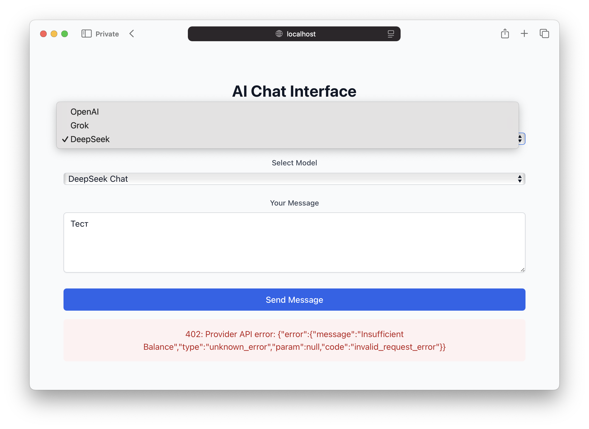

# GPT API Proxy



Прокси-сервис для работы с различными GPT API (OpenAI, Grok, DeepSeek). Проект собран с помощью CursorAI


## Возможности

- Единый интерфейс для работы с разными GPT API
- Поддержка OpenAI, Grok и DeepSeek
- Rate limiting и кэширование
- Мониторинг через Prometheus

## Установка

1. Клонируйте репозиторий:
```bash
git clone <repository-url>
cd gpt-api-proxy
```

2. Создайте виртуальное окружение и установите зависимости:
```bash
python -m venv venv
source venv/bin/activate  # для Linux/Mac
# или
.\venv\Scripts\activate  # для Windows
pip install -r requirements.txt
```

3. Настройка переменных окружения:

Создайте файл `.env` в корневой директории проекта и добавьте следующие переменные:

```bash
# API Keys для различных провайдеров
OPENAI_API_KEY=sk-...  # Ваш ключ OpenAI API
GROK_API_KEY=gk-...    # Ваш ключ Grok API
DEEPSEEK_API_KEY=ds-... # Ваш ключ DeepSeek API

# Настройки Redis
REDIS_HOST=localhost
REDIS_PORT=6379

# Настройки rate limiting
RATE_LIMIT_PER_MINUTE=60  # Максимальное количество запросов в минуту

# Базовые URL для API (можно оставить по умолчанию)
OPENAI_BASE_URL=https://api.openai.com/v1
GROK_BASE_URL=https://api.grok.ai/v1
DEEPSEEK_BASE_URL=https://api.deepseek.com/v1
```

### Как получить API ключи:

1. **OpenAI API Key**:
   - Зарегистрируйтесь на [OpenAI Platform](https://platform.openai.com)
   - Перейдите в раздел API Keys
   - Создайте новый ключ
   - Ключ начинается с `sk-`

2. **Grok API Key**:
   - Зарегистрируйтесь на [Grok Platform](https://grok.ai)
   - Перейдите в раздел API Keys
   - Создайте новый ключ
   - Ключ начинается с `gk-`

3. **DeepSeek API Key**:
   - Зарегистрируйтесь на [DeepSeek Platform](https://deepseek.com)
   - Перейдите в раздел API Keys
   - Создайте новый ключ
   - Ключ начинается с `ds-`

### Важные замечания по безопасности:

1. Никогда не коммитьте файл `.env` в репозиторий
2. Храните API ключи в безопасном месте
3. Регулярно ротируйте API ключи
4. Используйте разные ключи для разработки и продакшена

4. Запустите приложение:
```bash
uvicorn main:app --reload
```

## Использование

### Пример запроса к API:

```python
import requests

response = requests.post(
    "http://localhost:8000/v1/chat/completions",
    json={
        "messages": [
            {"role": "user", "content": "Hello!"}
        ],
        "model": "gpt-3.5-turbo",
        "provider": "openai"
    }
)

print(response.json())
```

## Docker

Для запуска в Docker:

```bash
docker build -t gpt-api-proxy .
docker run -p 8000:8000 --env-file .env gpt-api-proxy
```


Либо
```bash
docker compose up --build
```

## API Endpoints

- `POST /v1/chat/completions` - основной эндпоинт для отправки запросов к GPT API
- `GET /` - проверка работоспособности сервиса

## Безопасность

- Все API ключи хранятся в переменных окружения
- Поддержка CORS
- Rate limiting для предотвращения злоупотреблений

## Лицензия

MIT 